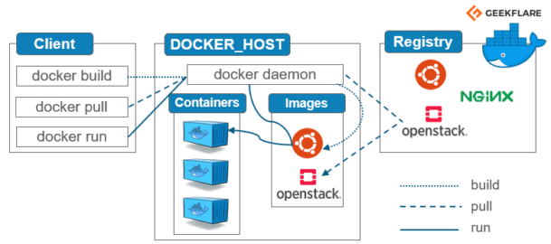

## Containers
* Standerdised, self contained pieces of software with the dependencies needed to run them
* Units of software that can be taken anywhere where docker runs
* Allows for the same application with the same environment to be ran anywhere
* Support for containers is built into modern operating systems
* Docker simplifies the process of managing containers, but not required
## Why containers- Different dev and production envs
* Why independent, standardized application packages
* Develeopment and production environments are often different e.g. dev enviornment may have software that requires a specific version to work, and another machine may have not have that version so it doesnt work
* Docker is self contained, therefore it has the software and the required version to run it
## Different dev environments within a team
* Every team member should have the exact same environment when working on the same project
## Clashing tools/ versions and between different projects
* When switching between projects,tools used in those projects may not be compatable with each other and cause errors
## Virtual machines/ Virtual operating systems
* Virtual machine runs inside your host machine
* Can install extra tools in virtual machine
* Problems - virtual OS is like a standalone machine, therefore lots of wasted space and resources -> eats up memory, cpu, harddrive space
* Adv- seperate envs, env specific config, env confi can be shared and reproduced.
* Disad - redundant duplication, e.g. all have linux installed seperately, slow, performance slow, boot times long, reproducing on other computers possible but can be tricky
## More on containers
* Still have host os
* Dont install new Os's, our OS has built in emulated container support
* Run docker engine 
* Can then spin up containers that contain code, libraries, dependencies and tools
* Dont have the heavy weight Os's like vm's
* Can configure and describe them with config files, and then share that config file so that they can make the same container
* Low impact OS, fast, minimal disk space
* Sharing, rebuilding and distribution easy
* Encapsulates apps/envs instead of whole machines
* VM's - bigger impact on OS, slower, more disk usage, sharing and rebuilding can be hard, encapsualtes whole machine instead of env
## Docker tools and building blocks
* Docker desktop used to install docker engine and to make sure that docker engine works
* Command line interface (CLI) is used to work with docker
* Docker hub lets us host our images in the cloud
* Docker compose - makes managing more complex containers easier
* Kubernetes - helps manage complex containereised applications
## Making a container
* Containers always based on images
* To create an image, create a `Dockerfile`
* Inside describe how container should be set up
* `. (dot)` -> current directory
* `docker build .` builds an image based on docker file
* produces an ID
* can run a container based on image with `docker run -p 3000:3000 ID` (the 3000 is the specific port)
* To stop, run `docker ps`
* Note the name of your docker process, and run `docker stop name`
## Images and containers
* Container
* Images -> templates for containers
* Images have required tools to execute the code
* Can create multiple containers based on image
* Container is the running instance of the image
* 2 ways of getting an image
* Use a colleagues images or a pre-built/ community image
* Can get images from docker hub
* Open cmd, navigate to folder of choice, run `docker run node` -> this will use node image from docker hub and create
## Microservices
* Microservices are an architectural and organizational approach to software development where software is composed of small independent services that communicate over well-defined APIs.
## Docker architecture
* Docker installed locally
* Want to communicate with dockerhub
* When a command such as `docker run` is activated on a local client, docker first checks local host resources, namely `docker_host` for the requested image
* If the local `docker-host` does not have the image, then api calls will be used to communicate with `dockerhub`
* This is done through api calls made in the background
* Once `dockerhub` gets the request, if the image exists and is gloablly available, it will be pulled into the local `docker_host` system and will be executed (depending on the command used)



## Docker commands
* **Management commands:**
* `Docker run` -> if image is locally unavailable, sends a request to docker hub. Run means pull and execute. Creates a container from image -> it is now in a running state
* `docker pull` -> only downloads it
* `docker build` -> Builds a docker image from a `Dockerfile` and a `context file` (for example, a file to be copied into an image, think about how nginx configurations are changed)
* `docker stop container_id`
* `docker start container_id`
* `docker push` -> send an image to dockerhub
* `-d` detached mode -> wont lock our browser
* `80:80` connect the local port 80 with image port
* For example: `docker run -d -p 80:80 nginx` ->This will download nginx image and execute it, creating a container
* Entering `localhost` into our search engine should show the nginx home page, because by default `localhost` uses port 80
* Push denied -> dont have access to your account or access to your repository
* `docker ps` -> shows how many containers are running, container id, from what image, what port, when it was created, up time, name of container
* `docker rm container_id -f` forcefully removes a specified container
*  buildx*     Docker Buildx (Docker Inc., v0.10.3)
*  compose*    Docker Compose (Docker Inc., v2.15.1)
*  config      Manage Docker configs
*  container   Manage containers
*  context     Manage contexts
*  dev*        Docker Dev Environments (Docker Inc., v0.1.0)
*  extension*  Manages Docker extensions (Docker Inc., v0.2.18)
*  image       Manage images
*  manifest    Manage Docker image manifests and manifest lists
*  network     Manage networks
*  node        Manage Swarm nodes
*  plugin      Manage plugins
*  sbom*       View the packaged-based Software Bill Of Materials (SBOM) for an image (Anchore Inc., 0.6.0)
*  scan*       Docker Scan (Docker Inc., v0.25.0)
*  scout*      Command line tool for Docker Scout (Docker Inc., v0.6.0)
*  secret      Manage Docker secrets
*  service     Manage services
*  stack       Manage Docker stacks
*  swarm       Manage Swarm
*  system      Manage Docker
*  trust       Manage trust on Docker images
*  volume      Manage volumes
* **Commands:**
*  attach      Attach local standard input, output, and error streams to a running container
*  build       Build an image from a Dockerfile
*  commit      Create a new image from a container's changes
*  cp          Copy files/folders between a container and the local filesystem
*  create      Create a new container
*  diff        Inspect changes to files or directories on a container's filesystem
*  events      Get real time events from the server
*  exec        Run a command in a running container
*  export      Export a container's filesystem as a tar archive
*  history     Show the history of an image
*  images      List images
*  import      Import the contents from a tarball to create a filesystem image
*  info        Display system-wide information
*  inspect     Return low-level information on Docker objects
*  kill        Kill one or more running containers
*  load        Load an image from a tar archive or STDIN
*  login       Log in to a Docker registry
*  logout      Log out from a Docker registry
*  logs        Fetch the logs of a container
*  pause       Pause all processes within one or more containers
*  port        List port mappings or a specific mapping for the container
*  ps          List containers
*  pull        Pull an image or a repository from a registry
*  push        Push an image or a repository to a registry
*  rename      Rename a container
*  restart     Restart one or more containers
*  rm          Remove one or more containers
*  rmi         Remove one or more images
*  run         Run a command in a new container
*  save        Save one or more images to a tar archive (streamed to STDOUT by default)
*  search      Search the Docker Hub for images
*  start       Start one or more stopped containers
*  stats       Display a live stream of container(s) resource usage statistics
*  stop        Stop one or more running containers
*  tag         Create a tag TARGET_IMAGE that refers to SOURCE_IMAGE
*  top         Display the running processes of a container
*  unpause     Unpause all processes within one or more containers
*  update      Update configuration of one or more containers
*  version     Show the Docker version information
*  wait        Block until one or more containers stop, then print their exit codes
## Potential errors
1) `Error response from daemon: driver failed programming external connectivity on endpoint frosty_borg (098a0a8feab147d648beafd66841142b78e9f1ccf65275a539350446ffe8be40): Bind for 0.0.0.0:80 failed: port is already allocated.` ->The port through which you are trying to access the container is alreay occupied by another container/ process
* Run `docker ps` and remove the container which is using the ip:
```
docker ps
```
* Then use the `container ID` to remove the process occupying the port:
```
rm container_id -f
```
* If a container is not using the same port and the issue persists, make sure that no other applications are using the port, for instance vagrant
2) `docker: Error response from daemon: Ports are not available: exposing port TCP 0.0.0.0:80 -> 0.0.0.0:0: listen tcp 0.0.0.0:80: bind: An attempt was made to access a socket in a way forbidden by its access permissions.` -> Your machine is preventing you from using the selected port
* To fix this, you will need to configure your firewall settings to allow the target port
## Manually editing an nginx image
1) Run the nginx image into a container using port 80:
```
docker -d -p 80:80 nginx 
```
2) Visualise the container ID:
```
docker ps
```
3) Interact with the container using a shell interface:
```
docker exec -it container_id sh
```
* If you receive an error mentioning `winpty`, run the following command and try the above steps again:
```
alias docker="winpty docker"
```
4) Navigate to the file responsible for what we see on the nginx home page, namely `index.html`
```
cd /usr
```
* Then :
```
cd share
```
* Then:
```
cd nginx
```
* Then:
```
cd html
```
5) Run an update to check internt connectivity:
```
apt get update
```
6) Run an upgrade:
```
apt get upgrade -y
```
7) Install a text editor like nano:
```
apt install nano
```
8) Edit the file with your desired output:
```
nano index.html
```
## Pushing a new image onto dockerhub using an edited image
* Images are immutable, therefore to save changes to an image a new image must be made which will have the new configuration
1) Exit the edited container after saving your changes:
```
exit
```
2) Visualise the container ID:
```
docker ps
```
3) Commit the changes to create a new container:
```
docker commit <existing-container-id> <hub-user>/<desired-repo-name/image-name>
```
4) Visualise the images to see if your image is made:
```
docker images
```
5) Tag the image:
```
docker tag <image-id> <hub-user>/<desired-repo-name/image-name>
```
6) Push the image to the desired repository:
```
docker push <hub-user></repo-name/image-name>
```
## Building an image with a different nginx display using the `nginx` image as a template
1) Inside a new directory, make a `Dockerfile
2) On the same level, make a `index.html` file
3) Inside the `index.html` file, enter the following code :
```
<html>  <head>   <title>Wellcome to Shahrukh's website</title>    <body>        <h1>Wellcome to Shahrukh's Website</h1>        <h2> This website is hosted inside a container using docker to build a Micro-Service</h2>        </body> </head></html>
```
4) Inside the `Dockerfile`, enter the following lines:
```
# Select base image
FROM nginx

# labelt it (optional)
LABEL MAINTAINER=shahrukh@sparta

# copy data from local host to the container
COPY index.html /usr/share/nginx/html/

# allow required port
EXPOSE 80

# execute required command
CMD ["nginx", "-g", "daemon off;"]
```
5) Build the image:
```
docker build -t <your-docker-host-name/image-name:v1> .
```
6) Execute the image, spinning up a container:
```
docker run -d -p 80:80 <your-docker-host-name/image-name:v1>
```
* From here, if the nginx webserver is working properly, you can push the image to your docker repository
7) First, you will need to tag the image:
```
docker tag <image-id> <docker-host-name>/<image-name>
```
8) Then push the image:
```
docker push <docker-host-name>/<image-name>
```
## Building an image of the node app
1) Create a new directory called `nodejs`
2) Inside the directory make a new `Dockerfile`
3) Copy your `app` directory into your `nodejs` directory, this can be done using the windows graphical interface
4) Inside the `Dockerfile`, enter the following code:
```
# From which image
FROM node:latest

RUN mkdir -p /app/src
# Set container working directory
WORKDIR /app/src
# copy data app folder

COPY package*.json .

# copy data app folder
COPY app .
# install dependencies (npm)
RUN apt update && apt upgrade -y && apt install nginx -y && apt -y install curl dirmngr apt-transport-https lsb-release ca-certificates && curl -sL https://deb.nodesource.com/setup_12.x && apt update && apt -y install nodejs && npm install pm2 -g 

# expose port
EXPOSE 3000
# launch app
CMD ["npm", "start", "daemon off;"]
```
* From here, if the app is working properly, you can push the image to your docker repository
5) First, you will need to tag the image:
```
docker tag <image-id> <docker-host-name>/<image-name>
```
6) Then push the image:
```
docker push <docker-host-name>/<image-name>
```
## Additional information about containers
* Stopped containers hold their state
* Once restarted they carry on from where they were stopped
* If we have nothing running on port80, we can run `docker run -d -p 80:80 nginx` and it will run faster because we already have the image from before
* If we did not commit a new image from an existing one and deleted our original image, our changes would be gone
* If we had just stopped it, the change would still be there, but we deleted the container without saving
* Images are immutable -> if you make a change have to rebuild image with new version
* Name : repo-name/image-name
* `docker run -d -p 4000:4000 docs/docker.github.io` -> lets you pull and execute an image which has the full docker documentation. You can now access the documentation offline on port 4000 : `localhost:4000`
* Docker - tool for containing, building and managing containers
## More on docker
* Can only have 1 dockerfile per directory/folder 
* Docker images are lightweight
* docker build -t benasj/tech201-nginx:v1 .
## Database
* docker run -d --name mongodb -v data:/data/db mongo
* -v -> volume
* Takes whatever is on /data/db and puts it on local host
## Building a docker container on an EC2 instance
1) Create a blank EC2 instance without an AMI
2) Use ubuntu 18.04
3) For security group rules, allow 22,80 and 3000
4) Run an update inside the instance:
```
sudo apt update
```
5) Run the following code:
```
curl -fsSL https://get.docker.com -o get-docker.sh
```
6) Install docker:
```
sudo sh get-docker.sh
```
7) Spin a container up from your image, for me this would be:
```
sudo docker run -d -p 3000:3000 benasj/app:v1
```
## Docker compose
* Docker compose helps run multiple containers in 1 file
* Helps link containers
* Fewer dependencies than K8, only dependency is docker
* Run multiple containers with a single command
* Need to spin up node container first, ssh into node, create environement variable with mongo container
* Mongo container must already be running
* Write a yaml script to create a container for mongo then node then environement variable
## Why K8
* Kubernetes is for big applications
## Doing
* Name the file docker-compose.yml
* Need 2 services, 1 for mongo, 1 for the app
* Volumes -> storage (like a usb drive) -> make data persistent
* Run script: `docker-compose up`
* Kill it: `docker-compose down`
##
* `command:` -> overwrites CMD instructions
## Docker compose information
* Docker is built in layers
* If something changes in a layer, it is run again, and so is every layer above the initially changed one
* Copy package.json first because it has all the dependencies
* Because package.json is in a lower layer than app, if anything in app is changed, all of the dependencies do not have to be reinstalled because they are cached (saved) in a lower layer
* package.json is a list of dependencies
* NPM install -> install the dependencies listed in package.json
* When database is populated by seed.js (program that sends thing to target instance, in this case mongo instance. Does this by using faker module in for loop which generates random words), that data is stored in /data/db
* **Named volumes**, anonymous volume -> used for protecting files so bind mount doesnt overwrite it, bind mount -> 
* Cant do node seeds/seed.js within run command
* RUN is within the image, and there is no database when the RUN command is ran, therefore node seeds/seed.js will never work
* Can read the env variable, but cannot link because there is no networking in images
* Can only resolve what mongo is in containerised form because thats when it is in a network
* Docker compose makes a default network with the name of the host folder
* Connects every container within docker-compose, they can therefore communicate using their container names
* This is why changing the mongodv.conf is unneccassary, the app and database are already linked through the network
* The container which seeds the database is destroyed after it does so, because there is no process concurantly running

